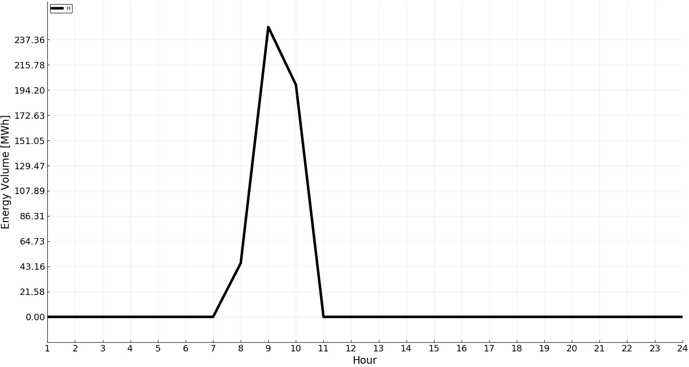
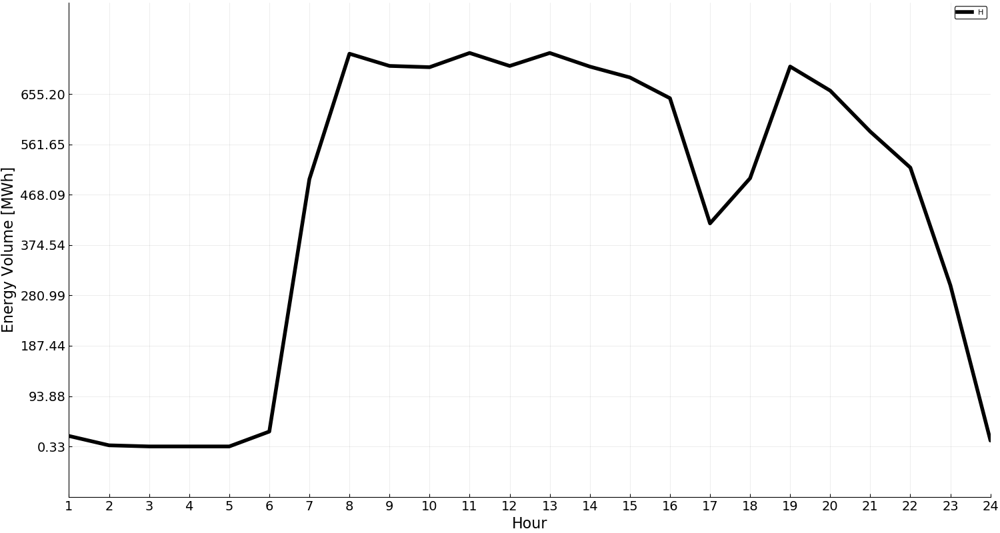
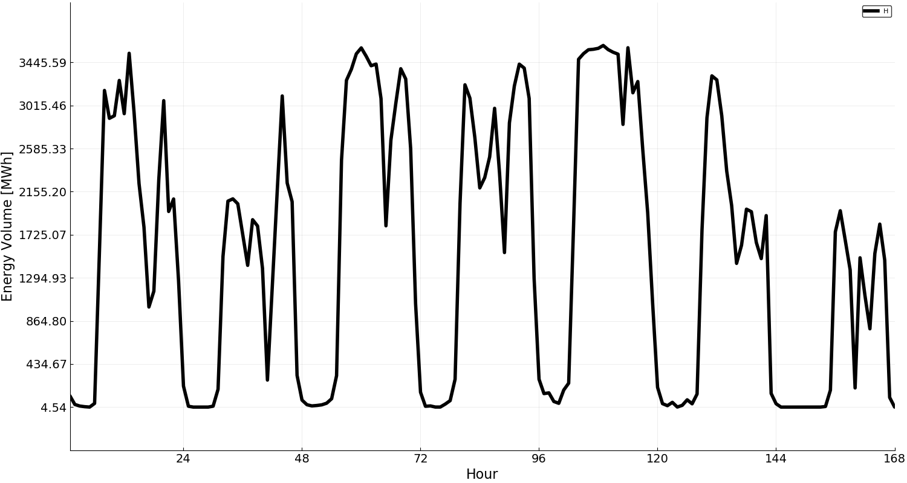
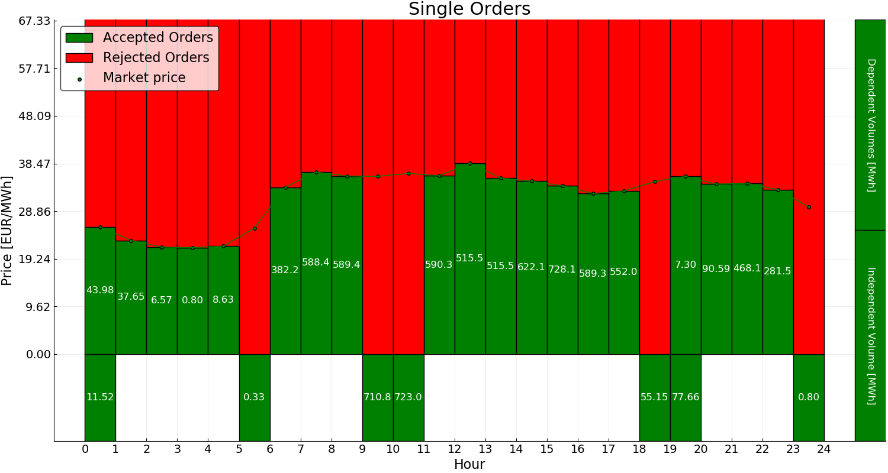

# HydroModels

[](https://travis-ci.org/martinbiel/HydroModels.jl)

[](https://coveralls.io/github/martinbiel/HydroModels.jl?branch=master)

[](http://codecov.io/github/martinbiel/HydroModels.jl?branch=master)

`HydroModels` is a modeling framework for hydropower operations. It provides templates for specifying deterministic, as well as stochastic (through [StochasticPrograms.jl][StochProg]), hydropower planning problems. Underlying optimization problems are formulated in [JuMP.jl][JuMP]. The model construction in `HydroModels` is deferred through anonymous creation functions, so that the underlying optimization problem is not formulated until data is added to the model.

[StochProg]: https://github.com/martinbiel/StochasticPrograms.jl
[JuMP]: https://github.com/JuliaOpt/JuMP.jl

## Creating a Planning Problem

A model of hydro power operations is created as follows:
 - Define model indices.
 - Define model data.
 - Define `modelindices(::AbstractHydroModelData, ::Horizon, args...)`, a function that computes the model indices based on the model data (+ time horizon and any extra arguments).
 - Define optimization problem.

When the optimization is defined, the following reserved keywords can be used:
 - _horizon_: the time horizon if the model
 - _indices_: structure with model indices
 - _data_: structure with model data

```julia
using HydroModels

 # Model indices
struct SimpleShortTermIndices <: HydroModels.AbstractModelIndices
    hours::Vector{Int}
    plants::Vector{Symbol}
    segments::Vector{Int}
end
```

`HydroModels` provides some predefined data structures. The struct `HydroPlantCollection` loads hydropower plant data: reservoir capacity, river topology, etc.

```julia
using HydroModels.HydroPlantCollection
struct SimpleShortTermData <: HydroModels.AbstractModelData
    hydrodata::HydroPlantCollection{Float64,2}
    Q_::Dict{Symbol,Float64}  # Minimal discharge
    H_::Dict{Symbol,Float64}  # Minimum  production
    D::Vector{Float64}        # Contracted load
    λ::Vector{Float64}        # Price curve
    λ_f::Float64              # Expected future price
end

# function to create indices from data
function HydroModels.modelindices(data::SimpleShortTermData,horizon::Horizon)
    hours = collect(1:HydroModels.nhours(horizon))
    plants = data.hydrodata.plants
    if isempty(plants)
        error("No plants in data")
    end
    segments = collect(1:2)
    return SimpleShortTermIndices(hours, plants, segments)
end
```

A simple deterministic planning problem can now be formulated as follows:

```julia
# Define model, by defining a JuMP optimization problem
@hydromodel Deterministic SimpleShortTerm = begin
    # Indices
    # ========================================================
    hours = indices.hours
    plants = indices.plants
    segments = indices.segments
    # Data
    # ========================================================
    hdata = data.hydrodata
    Q_ = data.Q_
    H_ = data.H_
    D = data.D
    λ = data.λ
    λ_f = data.λ_f
    # Variables
    # =======================================================
    @variable(model, Q[p = plants, s = segments, t = hours] >= 0) # Discharges for each plant, segment and hour
    @variable(model, S[p = plants, t = hours] >= 0) # Spillage from each reservoir each hour
    @variable(model, M[p = plants, t = hours], lowerbound = 0, upperbound = hdata[p].M̄) # Storage of the reservoirs each hour
    @variable(model, H[t = hours] >= 0) # Production each hour
    @variable(model, Hp[t = hours] >= 0) # Purchases each hour
    @variable(model, Hs[t = hours] >= 0) # Sales each hour
    @variable(model, z[p = plants, t = hours], Bin) # Plant activities each hour
    # Objectives
    # ========================================================
    # Net profit
    @expression(model, net_profit, sum(λ[t]*(Hs[t]-Hp[t]) for t = hours))
    # Value of stored water
    @expression(model, value_of_stored_water,
                0.98*λ_f*sum(M[p,24]*sum(hdata[i].μ[1]
                    for i = hdata.Qd[p])
                        for p = plants))
    # Define objective
    @objective(model, Max, net_profit + value_of_stored_water)
    # Constraints
    # ========================================================
    # Hydrological balance
    @constraint(model, hydro_constraints[p = plants, t = hours],
                # Previous reservoir content
                M[p,t] == (t > 1 ? M[p,t-1] : hdata[p].M₀)
                # Inflow
                + sum(z[i,t]*Q̲[i] + sum(Q[i,s,t]
                        for s = segments)
                            for i = hdata.Qu[p])
                + sum(S[i,t] for i = hdata.Su[p])
                # Local inflow
                + hdata[p].V
                # Outflow
                - (z[p,t]*Q_[p] + sum(Q[p,s,t]
                    for s = segments)
                + S[p,t]))
    # Production
    @constraint(model, production[t = hours],
                H[t] == sum(z[p,t]*H_[p] + sum(hdata[p].μ[s]*Q[p,s,t]
                            for s = segments)
                                for p = plants))
    # Define load balance constraints
    @constraint(model, load_constraint[t = hours],
                H[t] + Hp[t] - Hs[t] == D[t])
    # Define activity constraints
    @constraint(model, activity_constraint[p = plants, s = segments, t = hours],
                Q[p,s,t] <= z[p,t]*hdata[p].Q̄[s])
end
```

The actual values of `horizon`, `indices` and `data` are later injected to construct the planning problem. Assuming a `SimpleShortTermData` object has been loaded, the formulated planning problem can be created as follows:

```julia
julia> simple_model = SimpleShortTermModel(Day(),data)
Deterministic Hydro Power Model : Simple Short Term
    including 5 power stations
    over a 24 hour horizon (1 day)

Not yet planned
```

The model has binary variables, so a binary capable solver is required to plan the model

```julia
julia> using Cbc

julia> plan!(simple_model, optimsolver = CbcSolver())
Deterministic Hydro Power Model : Simple Short Term
    including 5 power stations
    over a 24 hour horizon (1 day)

Optimally planned
```

`HydroModels` recognizes certain variable names, such as `Q,H` and `S`. Hence, the formulated model can make use of functions provided by `HydroModels`.

```julia
julia> res = production(simple_model)
Hydro Power Production Plan
Power production:
   0.0
   0.0
   0.0
   0.0
   0.0
   0.0
   0.0
  46.0000000000005
 248.15
 198.6
   0.0
   0.0
   0.0
   0.0
   0.0
   0.0
   0.0
   0.0
   0.0
   0.0
   0.0
   0

julia> plot(res)
```



## Available Models
In addition to modeling templates, `HydroModels` provides some pre defined large-scale planning problems.

### Short-Term

Deterministic planning problem over a given time horizon. Model includes hydro plants located in rivers with given connections. The flow time between the plants is accounted for. The power production is optimized to maximize profits, given some price curve.

```julia
# Load data: hydro plant parameters + a price curve
julia> prices = HydroModels.PriceData("data/spotpricedata.csv");

julia> short_term_data = HydroModels.ShortTermData("data/plantdata.csv",prices[1]);

# Load a short-term deterministic model, over a one day planning horizon, of the
# river Ljusnan.
julia> short_term_model = ShortTermModel(Day(),short_term_data,:Ljusnan)
Deterministic Hydro Power Model : Short Term
    including 21 power stations
    over a 24 hour horizon (1 day)

Not yet planned

# Plan the model
julia> plan!(short_term_model)
Deterministic Hydro Power Model : Short Term
    including 21 power stations
    over a 24 hour horizon (1 day)

Optimally planned

# Extract a production plan from the solution
julia> res = production(short_term_model);

# Plot the production plan
plot(res)
```



Since model creation is deferred, the planning problem can be reinitialized with for example a longer horizon and more available hydropower plants.

```julia
# Reinitialize the model over one week, including two more rivers.
julia> reinitialize!(short_term_model,Week(),[:Ljusnan,:Indalsälven,:Skellefteälven])
Deterministic Hydro Power Model : Short Term
    including 63 power stations
    over a 168 hour horizon (1 week)

Not yet planned

# Replan and check the results.
julia> plan!(short_term_model)
Deterministic Hydro Power Model : Short Term
    including 63 power stations
    over a 168 hour horizon (1 week)

Optimally planned
julia> res = production(short_term_model);

julia> plot(res)
```



### Day-Ahead
Stochastic planning problem over a day. Optimizes bids (hourly order + block bids) on the day-ahead market, over given future scenarios on the next days electricity price. Each subproblem involves profit maximization akin to the short-term model above, where the demand is set by the bids.

```julia
julia> day_ahead_data = HydroModels.DayAheadData("data/plantdata.csv","data/spotpricedata.csv",15.0,50.0);

julia> scenarios = HydroModels.DayAheadScenarios("data/spotpricedata.csv",5);

# Load a day-ahead stochastic model, of the river Ljusnan.
julia> day_ahead_model = DayAheadModel(day_ahead_data,scenarios,:Ljusnan)
Stochastic Hydro Power Model : Day Ahead
    including 21 power stations
    over a 24 hour horizon (1 day)
    featuring 5 scenarios

Recourse Problem: Not yet planned
Expected Value Problem: Not yet planned

# Plan the model
julia> plan!(day_ahead_model)
Stochastic Hydro Power Model : Day Ahead
    including 21 power stations
    over a 24 hour horizon (1 day)
    featuring 5 scenarios

Recourse Problem: Optimally planned
Expected Value Problem: Not yet planned

# Extract the order strategy from the solution
julia> orderstrategy = strategy(day_ahead_model)
Order Strategy
Price levels:
 -500.0
   15.0
   32.5
   50.0
 3000.0

# Check the result of the order strategy corresponding to the first price scenario
julia> plot(orderstrategy.single_orders,scenarios[1].ρ[Day()])

```


